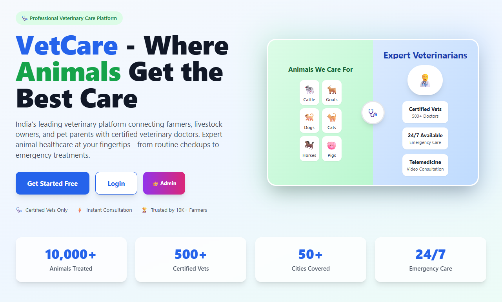
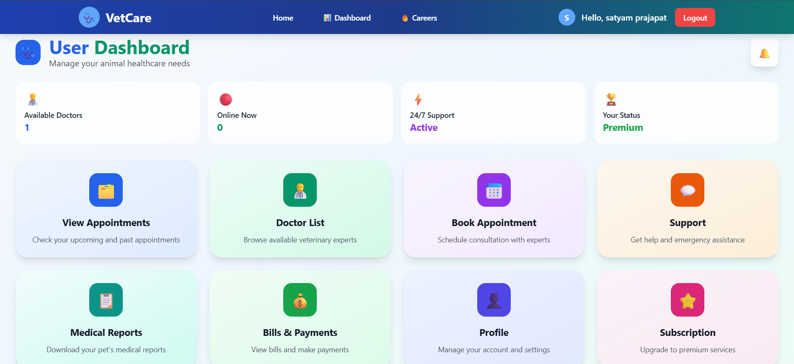
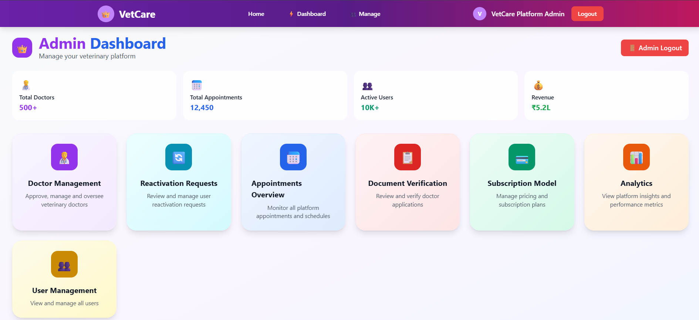
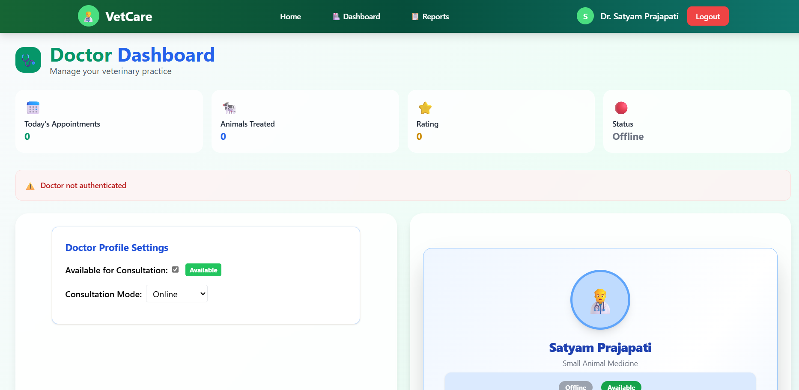
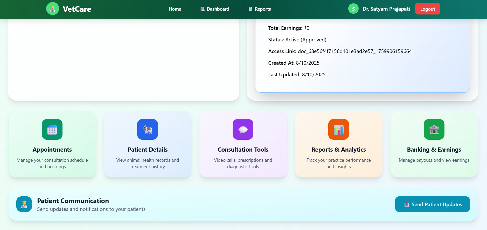
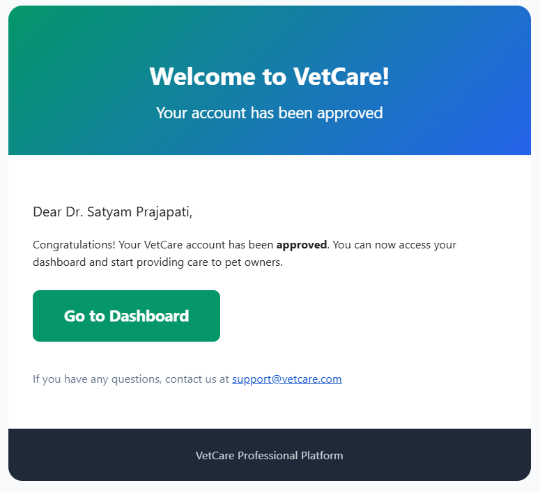
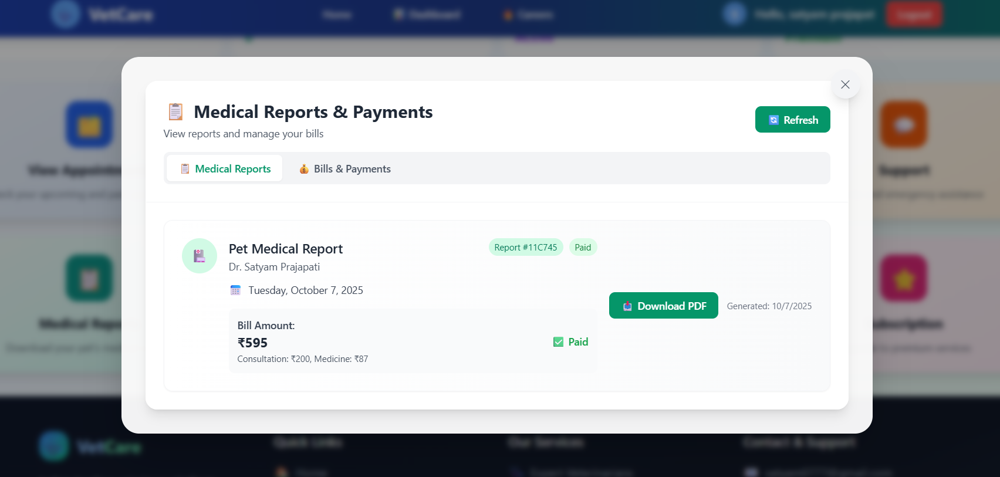
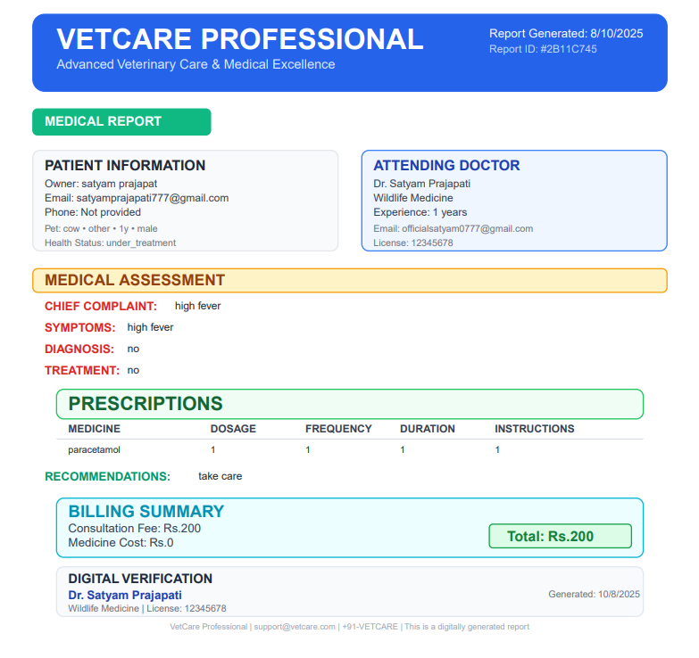

# VetCare Platform CRM

[Live Demo](https://vet-care-plateform-crm.vercel.app/) | [GitHub Repo]([https://github.com/Rg0522/VetCare-Platform-CRM])

---

## Overview
VetCare is a modern, full-stack veterinary care management platform that connects pet owners, doctors, and admins. It streamlines appointment booking, online consultations, payments, and medical report management—empowering clinics and pet owners with a seamless digital experience.

---
### VetCare Landing page


### User Dashboard


### Admin Panel


### Doctor Panel


### Doctor Features


### Email recive for all things ,just like Doctor Approved


### User Report & Bill


### Report Card



### For Knowing all the Feature , register for user , Apply to join as Docotr .


##  Key Features
- **Role-based Access:** Admin, Doctor, and User (Pet Owner) dashboards
- **Doctor Onboarding:** Career portal for doctor applications and admin verification
- **Appointment Booking:** Real-time scheduling, calendar, and status tracking
- **Online Consultation:** Secure video calls, chat, and prescription management
- **Medical Reports:** Downloadable, shareable reports and prescriptions
- **Payments:** Razorpay integration with itemized receipts (consultation fee, platform fee, tax)
- **Notifications:** Email (SendGrid) and in-app notifications for all major actions
- **Admin Controls:** Doctor/user management, analytics, and platform settings
- **Support & Help:** User dashboard with platform tips and support resources
- **Responsive UI:** Mobile-friendly, modern design (React + Tailwind CSS)

---

##  Live Demo
- **Frontend:** [https://vet-care-plateform-crm.vercel.app/](https://vet-care-plateform-crm.vercel.app/)
- **Backend:** Deployed on Render (see `.env` for API URL)

---

##  Project Structure
```
vetcare-frontend/   # React, Tailwind CSS, Vite
vetcare-backend/    # Node.js, Express, MongoDB,socket.io
```

---

##  User Flow
### User (Pet Owner)
1. Register/login
2. Book appointment with a verified doctor
3. Receive confirmation and reminders
4. Join online consultation
5. Receive/download medical report and prescription
6. Pay securely via Razorpay

### Doctor
1. Apply via Career Portal
2. Wait for admin verification
3. Manage appointments, conduct consultations, generate reports
4. Receive notifications for bookings and payments

### Admin
1. Review/verify doctor applications
2. Manage users, doctors, appointments
3. Monitor analytics and platform activity

---

## 🛠️ Tech Stack
- **Frontend:** React, Tailwind CSS, Vite
- **Backend:** Node.js, Express.js
- **Database:** MongoDB (cloud-hosted)
- **Authentication:** JWT, bcrypt
- **Payments:** Razorpay
- **Email:** SendGrid
- **File Storage:** (Recommended: AWS S3)
- **Real-time:** Socket.io
- **DevOps:** Docker, PM2, GitHub Actions, Render/Vercel

---

##  Installation & Setup
1. **Clone the repo:**
   ```bash
   git clone https://github.com/satyam0777/VetCare-Plateform-CRM.git
   cd VetCare-Plateform-CRM
   ```
2. **Backend:**
   ```bash
   cd vetcare-backend
   npm install
   # Set up .env (see .env.example)
   npm start
   ```
3. **Frontend:**
   ```bash
   cd vetcare-frontend
   npm install
   # Set up .env (see .env.example)
   npm run dev
   ```
4. **Access the app:**
   - Frontend: [http://localhost:5173](http://localhost:5173)
   - Backend: [http://localhost:5000](http://localhost:5000)

---

##  Roadmap & Scaling
- See [`STARTUP_ROADMAP.md`](./docs/STARTUP_ROADMAP.md) for a full checklist to make VetCare investor-ready and scalable as a real startup.
- See [`PROJECT_DESCRIPTION.md`](./docs/PROJECT_DESCRIPTION.md) for a detailed project overview and user flow.

---

##  Contributing
Pull requests are welcome! For major changes, please open an issue first to discuss what you would like to change.

---

##  License
This project is licensed under the MIT License.

---

##  About the Author
**Satyam Prajapati**  
[GitHub](https://github.com/satyam0777)  
[LinkedIn](https://www.linkedin.com/in/satyam0777/)  

---

> Built with ❤️ to modernize veterinary care and empower clinics, doctors, and pet owners.
